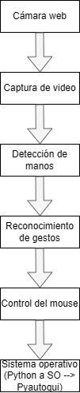
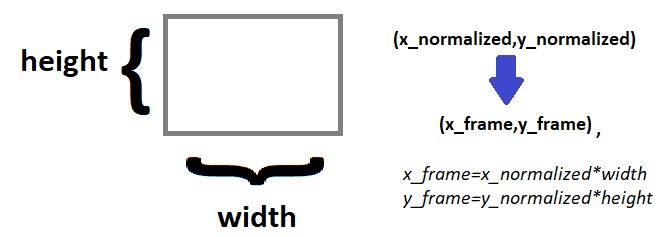
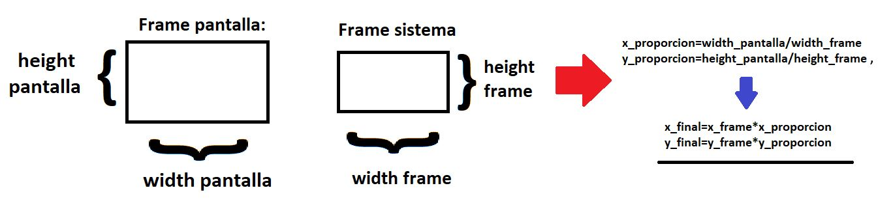
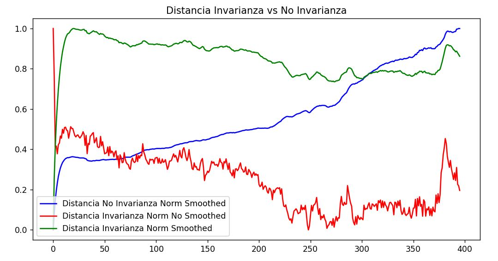
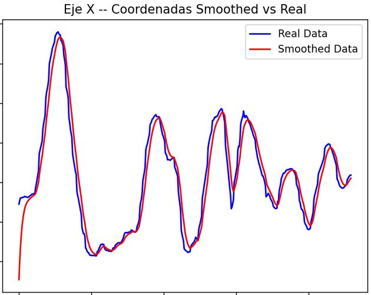
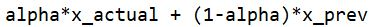

# <div align="center">VIRTUAL MOUSE USING HAND GESTURES</div>

## 1) DESCRIPCIÓN DEL PROYECTO
Este proyecto contiene el desarrollo de un *mouse* virtual que permite controlar el cursor y ejecutar acciones del *mouse* utilizando gestos de las manos. Mediante el modelo *Mediapipe Hands*, se extraen las coordenadas de los puntos clave de ambas manos, y se aplican técnicas de *Computer Vision* orientados a la invarianza a escala y fórmulas de suavizado (*smoothing*) para evitar el temblor (*jitter*) en el movimiento del cursor. 

----

## 2) PLANTEAMIENTO DEL PROBLEMA
La interacción con una computadora depende principalmente de dispositivos físicos como el *mouse*. En situaciones donde se requiere una interacción sin contacto o una mayor accesibilidad, estos dispositivos pueden resultar poco prácticos. Este proyecto propone una solución basada en *Computer Vision* (visión por computadora) que permite controlar el cursor y ejecutar acciones del *mouse* mediante gestos de la mano capturados por una cámara. 

----

## 3) DESCRIPCIÓN DEL SISTEMA
El sistema permite controlar el cursor de una computadora mediante gestos de la mano capturados por una cámara. A través de técnicas de *Computer Vision*, el sistema detecta y rastrea los movimientos de las manos en tiempo real, interpreta gestos específicos y los convierte en acciones equivalentes a las de un mouse convencional.

### <ins>3.1) Funcionamiento del sistema:</ins>
  1) La cámara captura video en tiempo real.
  2) El sistema procesa cada fotograma para detectar las manos del usuario.
  3) Se identifican los *keypoints* (puntos clave).
  4) Los gestos realizados por el usuario son reconocidos mediante reglas predefinidas.
  5) Cada gesto se traduce en una de las siguientes acciones del *mouse*: mover el cursor, hacer *click* y *scrolling*.
  6) La acción es ejecutada por el sistema operativo utilizando la librería *pyautogui*.

### <ins>3.2) Arquitectura del sistema:</ins>
<div align="center">
  
</div>

### <ins>3.3) Características principales:</ins>
  1) Seguimiento de la mano en tiempo real.
  2) Control del cursor sin necesidad de *mouse* físico.
  3) Reconocimiento de múltiples gestos: mover el cursor, hacer *click* y *scrolling*.
  4) Interacción intuitiva y sin contacto.
  5) Uso de una cámara convencional como dispositivo de entrada.

----

## 4) TECH STACK
A continuación, se especifican las herramientas que utilicé para desarrollar el *mouse* virtual:

<div>
  
| <ins>**Tech Stack**</ins>                                              | <ins>**Recursos**</ins>    |
|-------------------------------------------------------------|-----------------|
| Lenguaje de programación                                    | Python          |
| Computer Vision                                             | OpenCV          |
| Detección de manos                                          | Mediapipe Hands |
| Control del mouse                                           | PyAutoGUI       |
| Procesamiento numérico                                      | Numpy, Math     |
| Almacenamiento de datos                                     | Json            |
| Visualización de gráficas (invarianza a escala y smoothing) | Matplotlib      |
| Hardware                                                    | Cámara          |

</div>

----

## 5) MAPEO DE COORDENADAS E INVARIANZA A ESCALA

### 5.1) MAPEO DE COORDENADAS:
Las coordenadas de los *keypoints* que se obtienen al utilizar el modelo *Mediapipe Hands* se encuentran normalizadas en un rango de 0-1, y en relación al ancho y alto del *frame*. En ese sentido, para obtener las coordenadas de los píxeles en la resolución del *frame* actual, se multiplican las coordenadas normalizadas por el ancho y alto del *frame*.

El *frame* que procesa el sistema es de 640x640, por lo que las coordenadas "x" e "y" capturadas por el modelo *Mediapipe Hands* se multiplican por 640, respectivamente.

<div align="center">
  
</div>

<p align="center">
  <sub>Figura: Conversión de las coordenadas normalizadas a la resolución del frame que procesa el sistema.</sub>
</p>


El proceso anterior mapea las coordenadas normalizadas de *Mediapipe Hands* a posiciones de píxeles en la resolución del frame actual (640x640); sin embargo, estas deben redimensionarse al alto y ancho de la pantalla de la computadora en que se ejecuta para permitir el movimiento del cursor en toda la pantalla, y no solo en una región de esta.

Para ello, se calculan las "proporciones" del alto y ancho de la pantalla respecto al alto y ancho del frame del sistema (640,640), para multiplicarlos con las coordenadas "x" e "y" del *frame* ("x_frame,y_frame"), quedando como coordenadas finales "x_final" e "y_final" que se utilizarán para mover el cursor.
A continuación, se detalla dicho proceso en la siguiente figura:

<div align="center">
  
</div>


### 5.2) INVARIANZA A ESCALA:

La distancia entre los dedos incrementa o decrementa cuando ambos están más cerca/lejos de la cámara. Dado que el *left click* funciona en base a un *threshold* de distancia, la invarianza puede ocasionar falsos positivos (falsos *clicks*). 
Para aplicar invarianza a escala, se define un punto central de referencia (wrist). A partir de este, se calcula la distancia entre el wrist y el landmark 9. Luego, todos los demás keypoints se normalizan dividiendo sus distancias respecto a ese valor.

La siguiente gráfica compara el comportamiento de la distancia normalizada bajo diferentes configuraciones del sistema, evaluando el efecto de la invarianza a escala y el suavizado ([*smoothing*](#7-reducción-de-temblor-en-el-movimiento-del-cursor), se explica más adelante también):

<div align="center">
  
</div>

- **Azul:** Distancia sin invarianza a escala con suavizado  
- **Rojo:** Distancia con invarianza a escala sin suavizado  
- **Verde:** Distancia con invarianza a escala y suavizado (*smoothed*)

Se observa que la configuración sin invarianza a escala (azul) presenta un aumento progresiva debido a la dependencia del tamaño de la mano, afectando la estabilidad del seguimiento. Por otro lado, la invarianza a escala (rojo y verde) reduce este efecto, aunque introduce ruido en ausencia de suavizado (*smoothing*).

La combinación de **invarianza a escala + suavizado (verde)** fue la configuración seleccionada, ya que proporciona la mejor estabilidad general, reduciendo tanto la sensibilidad al tamaño como el temblor (*jitter*) en la trayectoria del movimiento del cursor, manteniendo un comportamiento consistente a lo largo del tiempo.

El pico final corresponde a una interrupción del sistema (botón de salida), por lo que no representa el comportamiento normal del modelo.

----

## 6) RECONOCIMIENTO DE GESTOS

Los gestos que permite el *mouse* virtual, actualmente, se describen a continuación:

- <ins>**Movimiento del cursor:**</ins>

  La punta del dedo índice de la mano izquierda se utiliza para el movimiento del cursor.

- <ins>**Left click:**</ins>

  Para hacer *left click* se deben acercar las puntas de los dedos índice y pulgar de la mano izquierda (funciona en base a un *threshold* de distancia entre ambos para evitar falsos positivos).
  
- <ins>**Scrolling:**</ins>

  El *scrolling*, mediante el mouse virtual, se realiza utilizando la mano derecha:
    - levantar el dedo índice de la mano derecha implica *scrolling* hacia abajo.
    - levantar el dedo medio de la mano derecha implica *scrolling* hacia arriba.

----

## 7) REDUCCIÓN DE TEMBLOR EN EL MOVIMIENTO DEL CURSOR

Al controlar el movimiento del cursor mediante las coordenadas de la punta del dedo índice de la mano izquierda, se observó la presencia ruido que generó pequeñas oscilaciones y temblores en la trayectoria del cursor, afectando la calidad de la usabilidad.

Para ello, se aplicó la fórmula de suavizado (*smoothing*) ["Exponential Moving Average Filtering (low-pass filter)"](#formula_smoothing), con el objetivo de reducir las oscilaciones en el movimiento del cursor. A continuación, se muestran las gráficas del "antes" (líneas azules) y "después" (líneas rojas) de aplicar el suavizado a las trayectorias del movimiento del dedo índice de la mano izquierda:

<p align="center">
    
</p>

<p align="center">
  <sub>Figura: (izquierda) Coordenadas 'x' - Index Finger (derecha) Coordenadas 'y' - Index Finger </sub>
</p>

Como se observa en las figuras, se aprecia un suavizado en las funciones que describen las trayectorias de movimiento de las coordenadas "x" e "y" del dedo índice de la mano izquierda, lo que refleja una reducción de las oscilaciones y temblores del cursor (se corroboró durante las pruebas de funcionamiento (*testing*) del mouse virtual).

**NOTA:** El vaivén de la gráfica se debe al movimiento del cursor sobre la pantalla. La reducción de las oscilaciones y temblores se describen por el suavizado de la gráfica de la función de trayectoria del movimiento del cursor.


> **IMPORTANTE:** Fórmula de suavizado *smoothing* - "Exponential moving average filtering"

> <div align="center" id="formula_smoothing">
>  
> </div>

> --> El valor alpha en la fórmula es 0.30. Se estableció luego de realizar pruebas.

> --> El valor 0.30 indica que se prioriza el valor *smoothed* previo, reduciendo de forma más significativa el temblor en la trayectoria del movimiento del cursor.

----

## 8) MEJORAS E INCIDENCIAS RESUELTAS

El *mouse* virtual fue optimizado iterativamente resolviendo varios problemas clave. A continuación, se detallan los problemas detectados y las soluciones implementadas que los resolvieron.

### 8.1) Invarianza a escala
  - La distancia entre los dedos incrementa o decrementa cuando ambos están más cerca/lejos de la cámara. Dado que el *left click* funciona en base a un *threshold* de distancia, la invarianza puede ocasionar falsos positivos (falsos *clicks*). 
  Para aplicar invarianza a escala, se define un punto central de referencia (wrist). A partir de este, se calcula la distancia entre el wrist y el landmark 9. Luego, todos los demás keypoints se normalizan dividiendo sus distancias respecto a ese valor. Dichas coordenadas con invarianza a escala (y *smoothed*) son las que se utilizan para la detección de gestos.


### 8.2) Puntero del cursor con latencia
  - El puntero del sistema presentaba latencia, pero se solucionó mediante el parámetro "_pause=True" en la función "moveTo" en *PyAutoGUI*


### 8.3) Ruido en la trayectoria del cursor
  - La trayectoria del cursor presentaba oscilaciones y temblores, que fueron solucionados al aplicar la fórmula *Exponential Moving Average Filtering* para el suavizado de la trayectoria. Dichas coordenadas con invarianza a escala y *smoothed* son las que se utilizan para la detección de gestos.


### 8.4) Evento *click* continuo
  - Si la distancia entre los dedos índice y pulgar de la mano izquierda se mantenían cerca durante frames consecutivos, provocaban *left clicks* continuos, generando dificultades en la interacción. Como solución, se añadió un *"flag"* que se evalúa en cada frame:
     Si la distancia 'pequeña' se mantiene entre los dedos durante frames consecutivos, quiere decir que el usuario continúa "clickeando" sobre el mismo ícono. Así, el sistema solo lanza 1 click durante ese tiempo para evitar *left clicks* continuos.


### 8.5) Movimiento del cursor durante el *left click*
  - Al usarse el dedo índice de la mano izquierda para dirigir el movimiento del cursor, y usar los dedos pulgar e índice (también de la mano izquierda) para simular el *left click* mediante un threshold por "distancia", al realizar el *left click* (acercar ambos dedos) la dirección del puntero también cambiaba, puesto que el dedo índice tendía a moverse al haber ese acercamiento.
  Para **mitigar** el problema identificado, implementé las siguientes estrategias:
      - **x_prev, y_prev**: Estas variables almacenan el último valor de 'x' e 'y' ANTES de ingresar a la condicional de "distancia", ocasionando que el click se dé en la coordenada final x_prev,y_prev, evitando el movimiento involuntario del dedo.
      - **click_det**: Se añadió una variable *booleana* "click_det" que se encarga de permitir el movimiento del cursor SOLO cuando NO se detecta la distancia mínima (*threshold*) para realizar el *left click*.

----

## 9) MEJORAS Y TRABAJO FUTURO
  - Se plantea como mejora futura desacoplar el control del cursor y la ejecución del clic izquierdo, los cuales actualmente comparten el uso del dedo índice izquierdo. Aunque se implementaron mecanismos de mitigación mediante variables booleanas y el almacenamiento de las coordenadas previas al click, aún se observan desplazamientos involuntarios durante el gesto, por lo que la solución actual solo reduce el problema, pero no lo elimina completamente. Como alternativa, se evaluará la reasignación del clic a otro dedo u otras estrategias de separación de gestos que reduzcan la interferencia entre acciones y mejoren la precisión de la interacción.
  - Se plantea la incorporación de nuevas acciones basadas en gestos en versiones futuras del sistema, con el objetivo de ampliar las capacidades de interacción y cubrir funcionalidades adicionales de control del cursor.

----

## 10) ESTRUCTURA DEL PROYECTO

```plaintext
file-root/
|
|--- results_graphics/
|    |-- (archivos json para la visualización de la trayectoria del cursor del mouse e invarianza a escala de coordenadas)
|
|--- graficas.py
|--- main.py
|--- save_data_plot.py
|--- utils.py
|--- images/
|    |--- (imágenes utilizadas en el README)
|
|--- requirements.txt 
|--- README.md
```

- [**main.py:**](./main.py) Archivo principal a ejecutar para utilizar el mouse virtual.
- [**save_data_plot.py:**](./save_data_plot.py) Almacenamiento de los valores de la trayectoria del cursor y la invariaza a escala de las coordenadas.
- [**graficas.py:**](./graficas.py) Archivo que permite visualizar las gráficas de las coordenadas del cursor.
- [**utils.py:**](./utils.py) Contiene la función que realiza la invarianza a escala de las coordenadas.

----

## 11) EJECUCIÓN LOCAL

Para ejecutar el *mouse virtual*, sigue los pasos descritos:

#### 1) Clonar repositorio
- Clonar el repositorio (recomendado en el escritorio):
```bash
git clone (link_del_repo)
```

#### 2) Carpeta
- Ingresar a la carpeta donde clonaste el repositorio:
```bash
cd [Ruta_donde_clonaste_el_repositorio]
```

#### 3) Environemnt
- Crear el environment de Python:
```bash
python3 -m venv virtual-mouse-env
```

#### 4) Activación del environment
- **Ubuntu**:
  - Si estás en Ubuntu, debes activar el *environment* de Python mediante el siguiente comando:
    ```bash
      source virtual-mouse-env/bin/activate
    ```
- **Windows**:
  - Si estás en Windows, activas el *environment* de Python mediante del siguiente comando:
    ```bash
    .\virtual-mouse-env\Scripts\activate
    ```

#### 5) Librerías
- Instalar las librerías necesarias para la ejecución del *mouse* virtual:
```bash
pip install -r requirements.txt
```

#### 6) Ejecución
- Finalmente, para ejecutar y utilizar el *mouse* virtual, colocar
  ```bash
    python ./main.py
  ``` 
  **NOTA**: El proyecto utiliza OpenCV para acceder a la cámara del dispositivo a través de "VideoCapture" colocado en el archivo .main, línea 60.

  El parámetro colocado en la función VideoCapture() puede variar:
    - 0 normalmente corresponde a la cámara principal (integrada en laptops o webcam por defecto).
    - 1, 2, etc. pueden corresponder a cámaras externas o adicionales.
